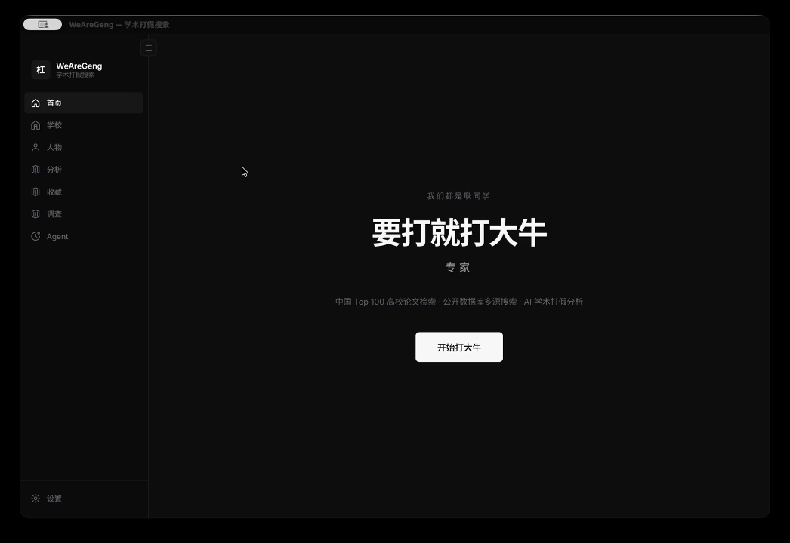

# WeAreGeng — 学术打假搜索平台

[](https://github.com/425776024/weAreGeng/actions/workflows/ci.yml)
[](https://github.com/425776024/weAreGeng/releases/latest)
[](LICENSE)

**WeAreGeng**（我们都是耿同学）—— 内置 **1 万+** 杰青等公开学者人名、数据，用 **Agent** 做多步论文检索与学术诚信分析。

> 开源工具，基于公开数据，不构成任何法律结论或指控。

## 下载

**[→ 下载最新版（Releases）](https://github.com/425776024/weAreGeng/releases/latest)** · **[全部版本](https://github.com/425776024/weAreGeng/releases)**

预编译安装包（macOS / Windows / Linux），无需安装 Node / Rust。在 Release 页面的 **Assets** 中按系统选择：

| 系统 | 选哪个 |
|------|--------|
| Mac（M 芯片） | 文件名含 `aarch64` 的 `.dmg` |
| Mac（Intel） | 文件名含 `x64` 或 `x86_64` 的 `.dmg` |
| Windows | `.msi` 或 `.exe` |
| Linux | `.deb` 或 `.AppImage` |

安装后：**设置 → 大模型** 填入 API Key，即可使用 Agent 与 AI 分析。

> 若 [Releases](https://github.com/425776024/weAreGeng/releases) 尚无安装包，可在 [Actions → Release](https://github.com/425776024/weAreGeng/actions/workflows/release.yml) 查看构建进度；`main` 分支 push 也会在 [Build Tauri](https://github.com/425776024/weAreGeng/actions/workflows/build-tauri.yml) 产出临时 Artifacts。

## 演示

<p align="center">
  <a href="https://github.com/425776024/weAreGeng/raw/main/docs/use.mp4">
    
  </a>
  <br>
  <sub>▶ <a href="https://github.com/425776024/weAreGeng/raw/main/docs/use.mp4">观看完整演示视频（MP4）</a></sub>
</p>

> GitHub README 不支持 `<video>` 标签内嵌播放，因此用 GIF 预览 + MP4 完整视频链接。

## 核心能力

### 1 万+ 人物数据，开箱即用

本地内置 **10,203** 条公开学者记录（持续更新），覆盖院士、杰青、优青等荣誉类型，可按单位、姓名、领域检索——**无需联网即可浏览**。

| 类型 | 规模 |
|------|------|
| 中科院院士 | 969 |
| 工程院院士 | 988 |
| 国家杰青 | 5,243 |
| 国家优青 | 3,003 |
| 高校人才公示 | 677+ |

数据来源：中科院学部、中国工程院、国自然委公示及高校公开页面。详见 [`data/README.md`](data/README.md)。

### 智能 Agent 分析

配置 LLM 后，Agent 自动编排多步调查，而非单次问答：

- **学者调查** — 姓名 + 单位 → 论文画像、引用链、开源声明核查
- **AI 分析** — 单篇/批量论文学术诚信评估，结果持久化
- **Tool Calling** — 11+ 工具（联网搜索、本地 PDF、专家库检索等），会话记忆可跨轮保留

支持 DeepSeek、通义等 OpenAI-compatible 接口。

### 论文检索：数据库与期刊

**检索 API（多源合并）**

| 数据库 | 角色 | 覆盖 |
|--------|------|------|
| [**OpenAlex**](https://openalex.org/) | 主检索 | 2.5 亿+ 文献；整合 Crossref DOI、PubMed、arXiv 等开放元数据 |
| [**Semantic Scholar**](https://www.semanticscholar.org/) | 辅检索 | 2 亿+ 论文；引用图谱、摘要与作者指标 |

Agent 与前端搜索默认 **OpenAlex + Semantic Scholar 双源去重合并**；也支持粘贴链接或 ID 直接解析：

- **DOI**（CrossRef 注册）
- **arXiv** 预印本
- **PubMed**（PMID，经 OpenAlex 索引）
- OpenAlex / Semantic Scholar 论文 ID

**内置期刊快捷筛选**（`data/meta/journals.json`，检索仍走上述开放数据库）：

| 层级 | 期刊 |
|------|------|
| 顶刊 | Nature · Science · Cell · The Lancet · NEJM · PNAS |
| 重点 | IEEE TPAMI · JMLR · Nature Machine Intelligence · Nature Biotechnology · Nature Medicine · 科学通报 · 中国科学 · 计算机研究与发展 · 软件学报 · 中华医学杂志 |
| 综合 | PLOS ONE · Scientific Reports · Frontiers · IEEE Access |

设置页可开关各学术来源；联网搜索（DuckDuckGo / Serper / Tavily）作为论文检索的补充。

## 开发者

```bash
git clone --recurse-submodules https://github.com/425776024/weAreGeng.git && cd weAreGeng
# 已 clone 未拉 submodule：git submodule update --init --depth 1 vendor/mastra
npm install && npm run setup:node && npm run build:tauri-agent
npm run tauri:dev
```

架构与 MCP 接入见 [`docs/AGENT-ARCHITECTURE.md`](docs/AGENT-ARCHITECTURE.md)、[`docs/MCP.md`](docs/MCP.md)。

## 许可证

[MIT](LICENSE)
