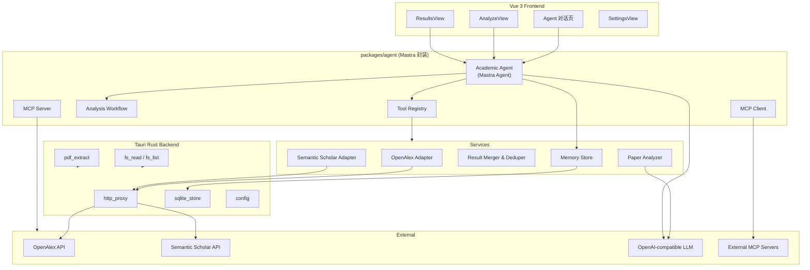

# WeAreGeng Agent 架构方案

> 版本：v0.1 · 2026-05-29  
> 目标：参考 Cursor / Codex / Claude 等编程助手的 Agent 模式，为学术打假平台引入复杂 Agent 能力——本地文件分析、跨会话记忆、论文检索与分析、MCP 协议扩展。

---

## 1. 背景与现状

WeAreGeng 是 Vue 3 + Tauri 2 桌面客户端，已有高校/专家浏览、LLM 配置、HTTP 代理等基础能力，但 Agent 核心逻辑尚未实现：

| 已有 | 备注 |
|------|------|
| `http_proxy` 绕过 CORS | Tauri Rust 后端 |
| LLM 配置 + Tool Calling | `llm_chat` / Node Mastra Agent |
| 真实论文搜索 | OpenAlex + S2 + merger |
| 论文 AI 分析 + SQLite 持久化 | analyzer + `analyses` 表 |
| Agent 多步对话 + 11 Tool | Node 子进程 + Mastra |
| 会话 / 分析 / 收藏持久化 | SQLite `sessions` / `messages` / `bookmarks` |
| Mastra Memory + semanticRecall | LibSQL + OpenAI embedding |
| MCP Server / Client | stdio + semantic-scholar-mcp |

---

## 2. 技术选型

### 2.1 核心决策

| 决策点 | 选型 | 理由 |
|--------|------|------|
| **Agent 框架** | [Mastra](https://github.com/mastra-ai/mastra) **本地克隆** | TypeScript 原生，与 Vue/Tauri 同栈；内置 Agent、Tool、Workflow、Memory、MCP |
| **论文 API（主）** | [OpenAlex](https://docs.openalex.org/) | 免费、无需 API Key、2.5 亿+ 作品、REST 简洁 |
| **论文 API（辅）** | [Semantic Scholar](https://api.semanticscholar.org/) | 200M+ 论文、AI TLDR、引用意图、作者 h-index |
| **PDF 解析** | Rust `pdf-extract`（Tauri 后端） | 桌面端性能更好，避免大 PDF 阻塞前端 |
| **记忆存储** | SQLite（Tauri 应用数据目录） | 零外部依赖、离线可用 |
| **协议扩展** | MCP（Model Context Protocol） | 与 Cursor 生态对齐，可对外暴露/接入外部 Tool |
| **HTTP 传输** | 现有 `http_proxy` + `proxiedFetch` | 复用已有 CORS 绕过能力 |
| **LLM 调用** | OpenAI-compatible API（已有配置） | 支持 function calling / structured output |

### 2.2 Mastra 本地克隆策略

不通过 npm 直接依赖 `@mastra/core`，而是将 Mastra 源码克隆到项目内作为子模块/本地包，便于：

- 针对学术场景定制 Tool 与 Memory 实现
- 避免上游版本 breaking change 影响桌面客户端稳定性
- 按需裁剪（仅保留 Agent / Tool / MCP / Memory 模块，去除 Cloud / Next.js 集成）

```
weAreGeng/
├── vendor/
│   └── mastra/              # git submodule 或 subtree 克隆
│       ├── packages/
│       │   ├── core/        # Agent, Tool, Workflow
│       │   ├── mcp/         # MCP Server / Client
│       │   └── memory/      # Memory 抽象
│       └── ...
├── packages/
│   └── agent/               # WeAreGeng Agent 封装层
│       ├── agents/
│       ├── tools/
│       ├── services/
│       └── mcp/
```

**克隆命令（初始化时执行一次）：**

```bash
git submodule add https://github.com/mastra-ai/mastra.git vendor/mastra
# 或在 package.json 中使用 file: 协议引用本地 packages
```

**依赖引用方式：**

```json
{
  "dependencies": {
    "@mastra/core": "file:./vendor/mastra/packages/core",
    "@mastra/mcp": "file:./vendor/mastra/packages/mcp"
  }
}
```

---

## 3. 总体架构



### 3.1 Agent 循环（ReAct / Tool Calling）

```
用户输入
  → LLM 推理（选择 Tool 或直接回答）
  → 执行 Tool（search_papers / analyze_paper / read_local_pdf / …）
  → 观察 Tool 结果
  → 继续推理（可多轮）
  → 流式输出最终回答
```

参考开源实现：

- [OpenHands](https://github.com/All-Hands-AI/OpenHands) — Event-stream + Tool Registry 模式
- [Mastra Agents](https://mastra.ai/docs/agents/overview) — TypeScript Agent 抽象
- [semantic-scholar-mcp](https://github.com/yogsoth-ai/semantic-scholar-mcp) — 学术论文 Tool 设计

---

## 4. 模块设计

### 4.1 论文搜索服务

#### OpenAlex（主数据源）

- **Base URL**：`https://api.openalex.org`
- **无需 API Key**，建议设置 `mailto` 参数进入 polite pool
- **核心端点**：
  - `GET /works?search={query}&filter=...` — 关键词搜索
  - `GET /works/{id}` — 单篇详情
  - `GET /works?filter=cites:{id}` — 引用链
  - `GET /authors?search={name}` — 作者搜索

**字段映射 → `Paper`：**

| OpenAlex 字段 | Paper 字段 |
|---------------|------------|
| `id` (OpenAlex URL) | `id` |
| `title` | `title` |
| `authorships[].author.display_name` | `authors[]` |
| `authorships[0].author.display_name` | `primaryAuthor` |
| `authorships[0].institutions[0].display_name` | `university` |
| `primary_location.source.display_name` | `journal` |
| `publication_year` | `year` |
| `abstract_inverted_index` → 重建摘要 | `abstract` |
| `doi` | `doi` |
| `primary_location.landing_page_url` | `url` |
| `open_access.oa_url` | `pdfUrl` |
| `"openalex"` | `source` |
| `cited_by_count` | `citations` |

#### Semantic Scholar（辅数据源）

- **Base URL**：`https://api.semanticscholar.org/graph/v1`
- **可选 API Key**（提高 rate limit）
- **核心端点**：
  - `GET /paper/search?query={q}&fields=...` — 搜索
  - `GET /paper/{paper_id}?fields=...` — 详情（支持 DOI、arXiv ID、S2 ID）
  - `GET /paper/{id}/citations` — 被引
  - `GET /paper/{id}/references` — 参考文献
  - `GET /author/search?query={name}` — 作者

**互补场景（OpenAlex 不足时 fallback 到 S2）：**

- 需要 AI 生成 TLDR 摘要
- 需要引用意图（context + intent）
- 需要作者 h-index、affiliations
- OpenAlex 某篇论文 metadata 缺失

#### 合并策略

```
1. 并行请求 OpenAlex + Semantic Scholar（respect Settings.sources 开关）
2. 按 DOI 去重（优先保留 OpenAlex 记录，S2 补充 citations/tldr）
3. 无 DOI 时按 title 相似度去重（Levenshtein > 0.9）
4. 按相关度 / 引用数排序
5. 应用 FilterPanel 筛选（年份、作者、领域、期刊）
6. dedupeByAuthor 模式：同一 primaryAuthor 仅保留最高分论文
```

**目录结构：**

```
packages/agent/services/
├── paper-search/
│   ├── openalex.ts          # OpenAlex 适配器
│   ├── semantic-scholar.ts  # S2 适配器
│   ├── merger.ts            # 多源合并去重
│   ├── types.ts             # 内部搜索参数/响应
│   └── index.ts             # searchPapers() 统一入口
```

---

### 4.2 PDF 解析

#### Tauri Rust 后端

新增命令：

| 命令 | 参数 | 返回 |
|------|------|------|
| `pdf_extract_text` | `{ path: string }` | `{ text: string, pages: number }` |
| `fs_read_text` | `{ path: string }` | `{ content: string }` |
| `fs_list_dir` | `{ path: string, recursive?: bool }` | `{ files: FileEntry[] }` |
| `fs_pick_file` | `{ filters?: string[] }` | `{ path: string \| null }` |

**Rust 依赖：**

```toml
# src-tauri/Cargo.toml
pdf-extract = "0.7"
```

**安全约束：**

- 仅允许读取用户通过文件选择器选定的路径，或应用数据目录内的文件
- 路径白名单校验，禁止 `../` 穿越
- 单文件大小上限（如 50 MB）

#### Agent Tool

```typescript
// packages/agent/tools/read-local-pdf.ts
createTool({
  id: 'read_local_pdf',
  description: '读取本地 PDF 文件并提取全文文本，用于论文内容分析',
  inputSchema: z.object({
    path: z.string().describe('PDF 文件绝对路径'),
  }),
  execute: async ({ path }) => {
    const { text, pages } = await invoke('pdf_extract_text', { path })
    return { text: text.slice(0, 100_000), pages, truncated: text.length > 100_000 }
  },
})
```

---

### 4.3 论文 AI 分析

#### 分析 Pipeline

```
输入（Paper 对象 或 本地 PDF 文本）
  → 获取全文（abstract 或 PDF extract）
  → 构造 System Prompt（学术打假专用）
  → LLM 结构化输出（JSON Schema）
  → 解析为 AnalysisResult
  → 持久化到 SQLite
```

#### 分析维度（Prompt 设计）

| 维度 | 说明 | severity |
|------|------|----------|
| 摘要-正文一致性 | 摘要声称 vs 正文实际内容 | high |
| 引用异常 | 自引过高、引用环、无关引用 | medium-high |
| 作者单位不匹配 | 作者 affiliation 与论文内容领域不符 | medium |
| 重复发表 | 与已知论文高度相似 | high |
| 数据/Image 问题 | 图表重复、统计异常（需全文） | high |
| 期刊/会议匹配 | 论文主题与发表 venue 是否匹配 | low-medium |

#### 结构化输出 Schema

```typescript
interface AnalysisResult {
  paperId: string
  paper: Paper
  analyzedAt: string
  summary: string
  score: number          // 0-100，越高越可疑
  flags: AnalysisFlag[]
  fullText?: string
}

interface AnalysisFlag {
  type: string
  severity: 'low' | 'medium' | 'high'
  description: string
  evidence: string       // 原文引用片段
}
```

---

### 4.4 Agent Tool 清单

基于 Mastra `createTool` 定义，首批 Tool：

| Tool ID | 描述 | 依赖 |
|---------|------|------|
| `search_papers` | 多源论文搜索（OpenAlex + S2） | paper-search service |
| `get_paper` | 按 DOI / arXiv ID / S2 ID 获取详情 | OpenAlex + S2 |
| `get_citations` | 获取引用链（被引 / 参考文献） | OpenAlex + S2 |
| `search_experts` | 检索本地专家库 | `data/experts/*.json` |
| `analyze_paper` | LLM 结构化分析 → AnalysisResult | analyzer service |
| `read_local_pdf` | 读取本地 PDF 提取文本 | Tauri `pdf_extract_text` |
| `read_local_file` | 读取本地文本文件 | Tauri `fs_read_text` |
| `web_search` | 网络搜索（Settings 配置的 provider） | http_proxy |
| `save_analysis` | 持久化分析结果 | SQLite |
| `recall_analyses` | 检索历史分析记录 | SQLite |
| `recall_memory` | 检索 Agent 会话记忆 | SQLite / Mastra Memory |

**Tool 注册示例：**

```typescript
// packages/agent/agents/academic-agent.ts
import { Agent } from '@mastra/core'
import { searchPapersTool } from '../tools/search-papers'
import { analyzePaperTool } from '../tools/analyze-paper'
import { readLocalPdfTool } from '../tools/read-local-pdf'
// ...

export const academicAgent = new Agent({
  name: 'academic-agent',
  instructions: `你是 WeAreGeng 学术打假助手。你可以搜索论文、分析可疑内容、
    读取本地 PDF、检索专家信息。分析时请引用具体证据，给出 severity 评级。`,
  model: openaiCompatible(config.llm.model, {
    baseURL: config.llm.baseUrl,
    apiKey: config.llm.apiKey,
  }),
  tools: {
    searchPapersTool,
    getPaperTool,
    getCitationsTool,
    searchExpertsTool,
    analyzePaperTool,
    readLocalPdfTool,
    webSearchTool,
    saveAnalysisTool,
    recallAnalysesTool,
  },
})
```

---

### 4.5 记忆与持久化

#### SQLite 表设计

```sql
-- 分析结果
CREATE TABLE analyses (
  id          TEXT PRIMARY KEY,
  paper_id    TEXT NOT NULL,
  paper_json  TEXT NOT NULL,       -- Paper 序列化
  summary     TEXT,
  score       REAL,
  flags_json  TEXT,                -- AnalysisFlag[]
  full_text   TEXT,
  analyzed_at TEXT NOT NULL,
  created_at  TEXT DEFAULT (datetime('now'))
);

-- Agent 会话
CREATE TABLE sessions (
  id          TEXT PRIMARY KEY,
  title       TEXT,
  created_at  TEXT DEFAULT (datetime('now')),
  updated_at  TEXT DEFAULT (datetime('now'))
);

-- 会话消息
CREATE TABLE messages (
  id          TEXT PRIMARY KEY,
  session_id  TEXT NOT NULL REFERENCES sessions(id),
  role        TEXT NOT NULL,       -- user | assistant | tool
  content     TEXT,
  tool_calls  TEXT,                -- JSON
  tool_results TEXT,               -- JSON
  created_at  TEXT DEFAULT (datetime('now'))
);

-- 用户收藏
CREATE TABLE bookmarks (
  id          TEXT PRIMARY KEY,
  paper_id    TEXT,
  paper_json  TEXT,
  note        TEXT,
  created_at  TEXT DEFAULT (datetime('now'))
);

CREATE INDEX idx_analyses_paper ON analyses(paper_id);
CREATE INDEX idx_messages_session ON messages(session_id);
```

**存储位置：** Tauri 应用数据目录 `{app_config_dir}/we-are-geng.db`

#### Mastra Memory 集成

使用 Mastra Memory 模块作为 Agent 运行时记忆层，SQLite 作为持久化后端：

```typescript
import { Memory } from '@mastra/memory'

const memory = new Memory({
  storage: sqliteStorage({ path: dbPath }),
  options: {
    lastMessages: 50,           // 保留最近 50 条消息
    semanticRecall: {
      topK: 5,
      messageRange: 2,
    },
  },
})
```

---

### 4.6 MCP 协议扩展

#### 作为 MCP Server（对外暴露能力）

WeAreGeng 内置 MCP Server，允许 Cursor / Claude Desktop 等外部 Agent 调用本平台能力：

```typescript
// packages/agent/mcp/server.ts
import { MCPServer } from '@mastra/mcp'

export const weAreGengMCP = new MCPServer({
  name: 'we-are-geng',
  version: '0.1.0',
  tools: {
    search_papers: { /* ... */ },
    analyze_paper: { /* ... */ },
    search_experts: { /* ... */ },
    get_citations: { /* ... */ },
  },
})
```

**启动方式：**

- Tauri 后端 spawn MCP Server 子进程（stdio transport）
- 或独立 CLI：`npx we-are-geng-mcp`

**Cursor 配置示例：**

```json
{
  "mcpServers": {
    "we-are-geng": {
      "command": "node",
      "args": ["./packages/agent/mcp/stdio.js"]
    }
  }
}
```

#### 作为 MCP Client（接入外部 Tool）

Agent 可连接外部 MCP Server 扩展能力：

| 外部 MCP Server | 用途 |
|-----------------|------|
| [semantic-scholar-mcp](https://github.com/yogsoth-ai/semantic-scholar-mcp) | 备用 S2 深度查询 |
| [agentmemory](https://github.com/rohitg00/agentmemory) | 跨工具语义记忆 |
| 用户自定义 MCP | 任意扩展 |

```typescript
import { MCPClient } from '@mastra/mcp'

const mcpClient = new MCPClient({
  servers: {
    'semantic-scholar': {
      command: 'npx',
      args: ['-y', 'semantic-scholar-mcp'],
    },
  },
})

// Agent 自动获取外部 MCP tools 并合并到 Tool Registry
const externalTools = await mcpClient.getTools()
academicAgent.addTools(externalTools)
```

---

## 5. 目录结构（目标）

```
weAreGeng/
├── docs/
│   └── AGENT-ARCHITECTURE.md       # 本文档
├── vendor/
│   └── mastra/                     # Mastra 本地克隆
├── packages/
│   └── agent/                      # Agent 封装层
│       ├── package.json
│       ├── agents/
│       │   └── academic-agent.ts
│       ├── tools/
│       │   ├── search-papers.ts
│       │   ├── get-paper.ts
│       │   ├── get-citations.ts
│       │   ├── analyze-paper.ts
│       │   ├── read-local-pdf.ts
│       │   ├── search-experts.ts
│       │   ├── web-search.ts
│       │   └── recall-analyses.ts
│       ├── services/
│       │   ├── paper-search/
│       │   │   ├── openalex.ts
│       │   │   ├── semantic-scholar.ts
│       │   │   ├── merger.ts
│       │   │   └── index.ts
│       │   ├── analyzer.ts
│       │   └── memory.ts
│       ├── mcp/
│       │   ├── server.ts
│       │   ├── client.ts
│       │   └── stdio.ts
│       └── index.ts
├── src/
│   ├── views/
│   │   └── AgentChatView.vue       # 新增：Agent 对话页
│   ├── api/
│   │   ├── client.ts               # 替换 search/analyze stub
│   │   └── agent.ts                # 新增：Agent API 封装
│   └── stores/
│       ├── app.ts
│       └── agent.ts                # 新增：Agent 会话状态
├── src-tauri/
│   └── src/
│       ├── lib.rs                  # 注册新命令
│       ├── pdf.rs                  # 新增：PDF 解析
│       ├── fs.rs                   # 新增：文件系统
│       └── db.rs                   # 新增：SQLite
└── data/                           # 不变
```

---

## 6. 分阶段实施计划

> **实施进度（2026-05-29）**：Phase 1–6 核心功能已落地。

### Phase 1：基础设施（1 周）

- [x] 创建 `packages/agent` 骨架（`@mastra/core` 本地 `file:` 依赖）
- [x] Tauri 新增 `pdf_extract_text`、`fs_read_text`、`fs_list_dir`、`fs_pick_file`
- [x] Tauri 新增 SQLite 模块（`we-are-geng.db`）
- [x] Tauri 新增 `llm_chat`（支持 Tool Calling）
- [x] Tauri capabilities 更新（dialog 权限）
- [x] 克隆 Mastra 到 `vendor/mastra`，切换为本地 `file:` 依赖（`npm run setup:mastra`）

### Phase 2：论文搜索（1–2 周）

- [x] 实现 OpenAlex 适配器（search / get）
- [x] 实现 Semantic Scholar 适配器（search / get）
- [x] 实现多源合并去重（merger.ts）
- [x] 替换 `api.search` stub，接入 Pinia store
- [x] ResultsView / ExpertResultsView 展示真实数据
- [x] 引用链 get_citations 适配器
- [x] 单元测试：OpenAlex / S2 响应 → Paper 映射（merger / openalex-map）

### Phase 3：论文分析（1–2 周）

- [x] 实现 analyzer service（prompt + structured output）
- [x] 定义分析 JSON Schema 与 `AnalysisFlag` 解析
- [x] 替换 `api.analyze` / `api.analyzeBatch` stub
- [x] 分析结果持久化到 SQLite
- [x] AnalyzeView 展示真实分析结果
- [x] 支持流式输出（Agent 最终回答逐字显示；Tauri `llm_chat_stream` SSE 已就绪）

### Phase 4：Agent 编排（2–3 周）

- [x] Tool Registry（search / analyze / read_pdf / experts）
- [x] ReAct Tool Loop（`src/services/academic-agent.ts` + `llm_chat` tools）
- [x] 新增 AgentChatView（对话 UI + Tool 调用展示）
- [x] 路由注册：`/agent` → AgentChatView
- [x] 基于 Mastra Agent 类重构编排层（Tauri Node 子进程 `agent_run`）
- [x] Agent 会话持久化（sessions / messages 表写入，含 Tool 消息）
- [x] Mastra Memory 集成（LibSQL + semanticRecall + OpenAI embedding）

### Phase 5：MCP 扩展（1–2 周）

- [x] MCP 配置骨架（`packages/agent/mcp/server.ts`）
- [x] 实现 WeAreGeng MCP Server（stdio transport）
- [x] 暴露 search_papers / analyze_paper / search_experts / get_citations / get_paper
- [x] 实现 MCP Client，可选接入 semantic-scholar-mcp（Node：`WEAREGENG_MCP_S2_ENABLED=1`）
- [x] 文档：Cursor / Claude Desktop 配置指南（见 `docs/MCP.md`）
- [x] Settings 页新增 MCP 配置区

### Phase 6：打磨与测试（1 周）

- [x] 单元测试：merger / retry-fetch / session-recall
- [x] API rate limit：OpenAlex / S2 指数退避重试
- [x] 收藏 bookmarks API + UI
- [x] MCP CLI 全量 Tool deps（`WEAREGENG_DB_PATH`）
- [x] 更新 AGENTS.md / README / MCP.md
- [ ] 端到端 UI 自动化（Playwright，可选）

---

## 7. 开源参考项目

| 项目 | 借鉴内容 | 链接 |
|------|----------|------|
| **Mastra** | Agent / Tool / Workflow / MCP / Memory 框架 | [github.com/mastra-ai/mastra](https://github.com/mastra-ai/mastra) |
| **OpenHands** | Event-stream 架构、Tool Registry、沙箱模式 | [github.com/All-Hands-AI/OpenHands](https://github.com/All-Hands-AI/OpenHands) |
| **semantic-scholar-mcp** | 学术论文 MCP Tool 设计 | [github.com/yogsoth-ai/semantic-scholar-mcp](https://github.com/yogsoth-ai/semantic-scholar-mcp) |
| **academic-paper-scraper** | S2 + arXiv 统一 JSON 输出 | [github.com/h120750572/academic-paper-scraper](https://github.com/h120750572/academic-paper-scraper) |
| **agentmemory** | 跨会话 MCP 记忆、SQLite + 混合检索 | [github.com/rohitg00/agentmemory](https://github.com/rohitg00/agentmemory) |
| **Vercel AI SDK** | 流式输出、Tool Calling 协议 | [github.com/vercel/ai](https://github.com/vercel/ai) |
| **OpenAlex Docs** | API 规范、字段说明 | [docs.openalex.org](https://docs.openalex.org/) |

---

## 8. 风险与约束

| 风险 | 缓解措施 |
|------|----------|
| OpenAlex / S2 API rate limit | 请求队列 + 指数退避；S2 可选 API Key；本地缓存热门查询 |
| Mastra 本地克隆维护成本 | 锁定版本 tag；仅引用必要 packages；定期评估是否切回 npm |
| PDF 解析质量（扫描件） | 首期仅支持文本型 PDF；扫描件 OCR 列为后续增强 |
| LLM 分析准确性 | 结构化输出 + 证据引用；Human-in-the-loop 确认 |
| MCP 安全 | MCP Server 仅暴露只读 Tool；文件访问需用户授权 |
| 大 PDF 内存 | Rust 后端流式提取；Agent Tool 截断至 100K 字符 |

---

## 9. 与现有代码的集成点

| 现有文件 | 变更 |
|----------|------|
| `src/api/client.ts` | `search` / `analyze` / `getCachedAnalyses` 从 stub 改为调用 `packages/agent` |
| `src/stores/app.ts` | 搜索/分析 action 对接真实服务 |
| `src-tauri/src/lib.rs` | 注册 pdf / fs / db 新命令 |
| `src/router/index.ts` | 新增 `/agent` 路由 |
| `src/views/SettingsView.vue` | 新增 MCP 配置、S2 API Key |
| `AGENTS.md` | 补充 Agent 开发指南 |

---

## 10. 成功标准

- [x] 用户可通过 FilterPanel 搜索论文，ResultsView 展示 OpenAlex + S2 真实结果
- [x] 用户可选中论文进行 AI 分析，AnalyzeView 展示结构化 `AnalysisFlag`
- [x] 用户可在 Agent 对话页用自然语言完成「搜索 → 分析 → 引用链追踪」多步任务
- [x] 用户可选择本地 PDF 文件进行内容分析
- [x] 分析结果和 Agent 会话在重启后仍可访问
- [x] 外部 MCP Client（如 Cursor）可调用 WeAreGeng 的论文搜索与分析 Tool
